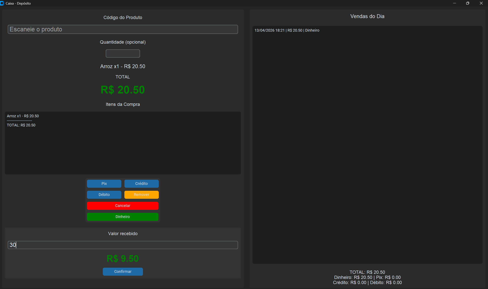

# 🧾 Sistema de Caixa em Python (PDV)

Sistema de ponto de venda (PDV) desenvolvido em Python com interface gráfica utilizando **CustomTkinter**, voltado para automação de vendas em lojas/depósitos.

O projeto simula um ambiente real de caixa, permitindo registrar produtos por código, controlar pagamentos e gerar relatórios diários de vendas.

---

## 🎯 Objetivo

Desenvolver uma aplicação prática que represente o funcionamento de um sistema de caixa real, integrando conceitos de:

- Interface gráfica
- Programação orientada a eventos
- Manipulação de dados em tempo real
- Controle financeiro básico
- Geração de relatórios

---

## ⚙️ Funcionalidades

### 🛒 Registro de produtos
- Leitura de produtos por código (simulando leitor de código de barras)
- Cadastro simples via dicionário
- Suporte a múltiplas quantidades por item
- Atualização automática do total da compra

---

### 📋 Controle da compra
- Exibição em tempo real dos itens adicionados
- Cálculo automático de subtotal por item
- Remoção do último item inserido
- Cancelamento completo da compra

---

### 💳 Formas de pagamento
- Pix
- Crédito
- Débito
- Dinheiro

---

### 💰 Pagamento em dinheiro
- Campo para inserir valor recebido
- Cálculo automático do troco
- Validação de valor insuficiente
- Exibição destacada do troco na interface

---

### 📊 Registro de vendas
- Armazenamento das vendas em memória durante a execução
- Registro de:
  - Data e hora
  - Valor da venda
  - Forma de pagamento
- Listagem das vendas em tempo real

---

### 📈 Resumo financeiro
- Total geral vendido
- Total por forma de pagamento:
  - Dinheiro
  - Pix
  - Crédito
  - Débito

---

### 🧾 Geração de relatório
- Criação automática de arquivo `.txt` ao fechar o sistema
- Nome do arquivo baseado na data
- Conteúdo do relatório:
  - Lista de vendas
  - Horário de cada venda
  - Forma de pagamento
  - Totais por categoria
  - Total geral do dia

---

## 🧠 Estrutura do Código

O sistema foi organizado em blocos funcionais para facilitar manutenção e leitura:

### 🔹 Produtos
Estrutura baseada em dicionário contendo:
- Código do produto
- Nome
- Preço

---

### 🔹 Controle de venda
Variáveis responsáveis por:
- Total da compra atual
- Lista de itens da compra
- Histórico de vendas

---

### 🔹 Funções principais

#### `ler_codigo()`
- Captura o código digitado/escaneado
- Valida o produto
- Calcula subtotal
- Atualiza interface e lista de itens

---

#### `atualizar_lista()`
- Atualiza a exibição dos itens da compra
- Mostra subtotal por item e total geral

---

#### `remover_item()`
- Remove o último item da compra
- Atualiza total e interface

---

#### `cancelar_compra()`
- Zera a compra atual
- Limpa lista de itens
- Reseta interface

---

#### `finalizar(forma)`
- Registra a venda com data, valor e forma de pagamento
- Atualiza histórico e resumo financeiro
- Reinicia o estado do sistema

---

### 💰 Módulo de dinheiro

#### `calcular_troco()`
- Calcula automaticamente o troco
- Valida valores inválidos ou insuficientes

#### `confirmar_dinheiro()`
- Finaliza a venda em dinheiro
- Exibe troco
- Registra a venda

---

### 📊 Relatórios

#### `salvar()`
- Gera arquivo `.txt` com resumo completo do dia
- Organiza dados de forma legível

---

## 🖥️ Interface gráfica

A interface foi construída utilizando **CustomTkinter**, proporcionando:

- Layout moderno (modo escuro)
- Organização em duas áreas:
  - Entrada e controle da compra
  - Histórico de vendas e resumo financeiro
- Atualizações em tempo real



---

## 🛠️ Tecnologias utilizadas

- Python
- CustomTkinter
- Tkinter
- datetime
- Manipulação de arquivos (I/O)

---

## ▶️ Como executar

1. Instale a dependência:

```bash
pip install customtkinter